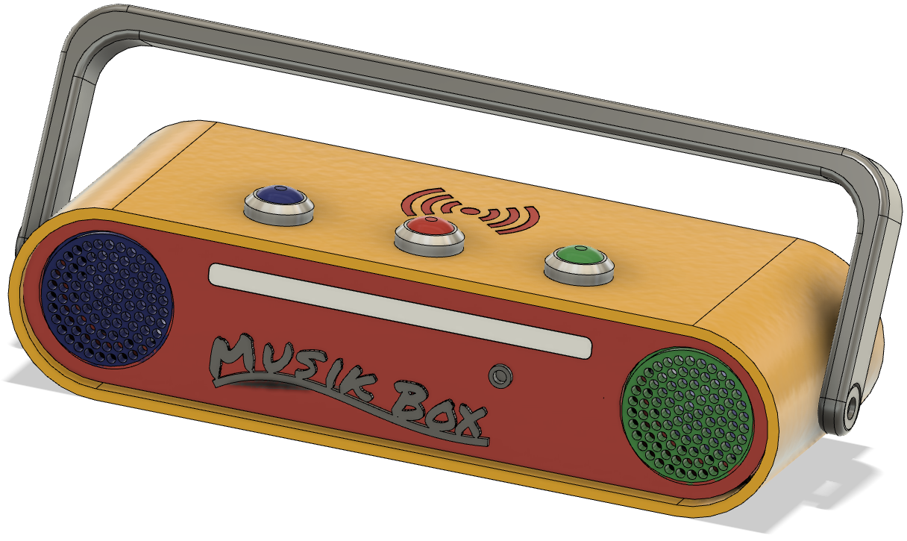

# TonMOBIL-Box
## Meine Box

## Danksagung
Als Vorlage für mein Projekt diente das Projekt TonUINO von Thorsten Voß.
[https://www.voss.earth/tonuino](https://www.voss.earth/tonuino)
## Einleitung
Die Zeiten von Kasseten und CD sind inzwischen vorbei. Heute sind MP3-Dateien das Medium der Wahl.
Die TonMOBIL-Box basiert auf dem OpenSource Projekt TonUNIO. Es ermöglicht auch Kleinkindern selbstständig ihre Lieblings-MP3 abzuspielen. Sie verbinden eine Figur oder einen Button mit der Musik oder einem Hörspiel.
## Eigenschaften
- Die Eltern füllen die SD-Karte der Box mit der Lieblingsmusik, oder den Lieblingshörspielen und ordnen diese einem NFC-Tags zu. Diese Tags können in der Fußplatte von Figuren, Motivkarten oder Buttons eingebaut sein.
- Zur Nutzung der Box muss das Kind nur die mittlere Taste einmal kurz drücken, nach wenigen Sekunden beginnt die Box eine MP3-Datei aus dem Album Nummer 1 abzuspielen.
- Durch aufsetzen einer Figur, Karte oder Button auf die Oberseite der Box können nun auch andere Alben ausgewählt werden. Die Box unterbricht nach Abnehmen der Figur / Button die Wiedergabe nicht. Ein widerholtes Aufsetzen spielt das nächste Lied / Hörspiel. 
- Die Wiedergabe kann durch kurzen Druck pausiert werden. Ein erneuter Kurzer Druck setzt die Wiedergabe fort. Verbleibt die Box 5 Minuten im Pausenmodus, wird die Box ausgeschaltet.
- Im Pausenmodus können durch langen Druck (>2 Sek.) vordefinierte Alben abgespielt werden.
- Im Playmodus knn über die beiden äuseren Tasten mit kurzen Tastendruck die Lautstärke verändert werden. Mit einem langen Tastendruck (>2 Sek.) Kann durch die Titel des aktuellen Albums geblättert werden.
- Wird wird auf der Vorderseite ein Kopfhörer angeschlossen, werden die Lautsprecher abgeschaltet.
## 3D-Druck
Das Gehäuse wurde komplett mit einem 3D-Drucker erstellt. Die STL-Dateien sind im Verzeichnis [STL-Dateien](STL-Dateien) verfügbar. Die STL-Dateien wurden mit Fusion360 erstellt. Eine Exportdatei vom Fusion-Projekt liegt im Verzeichnis [Fusion360](Fusion360).
## Hardware
Soweit es möglich war, wurden fertige Module benutzt. Dies vereinfacht den Aufbau der Schaltung. 

Für die Box wurde eine eigene Platine mit KICAD entwicket. Die für die Fertigung erforderliche Gerber-Datei ist im Ordner [KICAD](KICAD) verfügbar.

Der Schaltplan und die Verkabelung der Module können dem Handbuch [Technische Dokumentation (PDF)](Dokumente/TechnischeDokumentation.pdf) entnommen werden.
## Software
Die angepasste Firmware für den Arduino basiert auf der Lösung von Thorten Voß. [github.com/xfjx/TonUINO](https://github.com/xfjx/TonUINO)
Sie wurde um folgende Eigenschaften ergänzt:
- Einschalten über die Play/Pause-Taste.
- Statusanzeige in Form einer LED-Lichtleiste nach dem Vorschlag aus folgendem Forumsbeitrag. [https://discourse.voss.earth/t/integration-led-strip-und-ring-mit-neopixel/2760/8](https://discourse.voss.earth/t/integration-led-strip-und-ring-mit-neopixel/2760/8)
## Handbücher
Eine vollständige Beschreibung aller Funktionen findet sich im [Benutzerhandbuch (PDF)](Dokumente/Benutzerhandbuch.pdf).

Die technischen Details und die benötigten Bauteile können dem Handbuch [Technische Dokumentation (PDF)](Dokumente/TechnischeDokumentation.pdf) entnommen werden.
